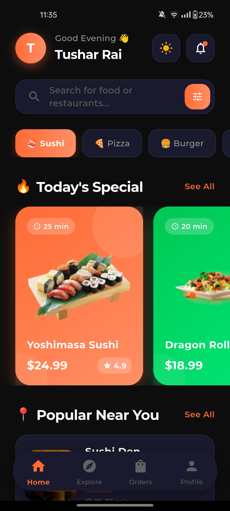
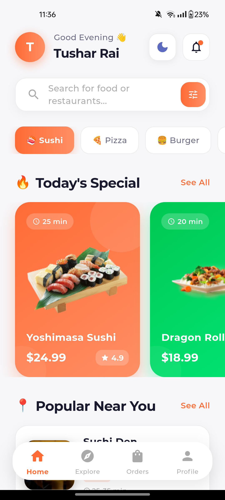
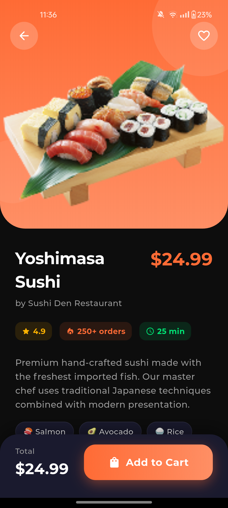
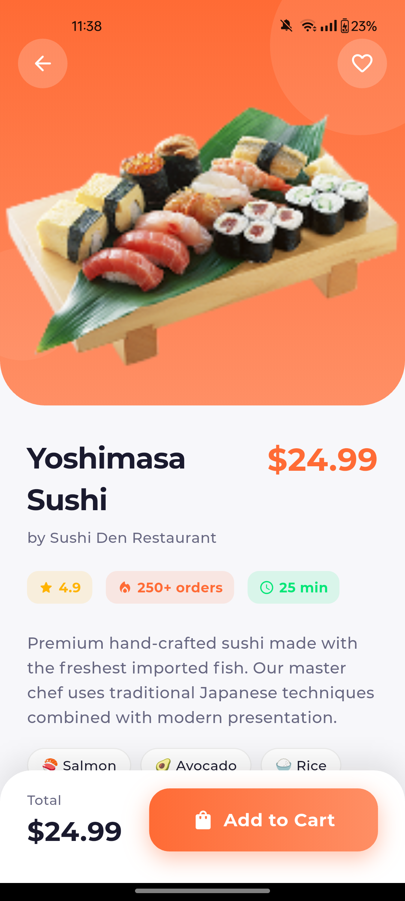

<div align="center">

# 🍣 Premium Flutter Food Delivery UI Kit

**A pixel-perfect, production-ready Flutter UI Kit for food delivery & restaurant apps.**

[](https://flutter.dev)
[](https://dart.dev)
[](LICENSE)
[](https://github.com/imtusharrai/flutter_food_ordering_app/stargazers)

<p align="center">
  <br>
  Built with ❤️ by <a href="https://github.com/imtusharrai">Tushar Rai</a>
</p>

---

</div>

This repository features a **world-class, high-end Flutter Food Ordering application interface**, designed with modern design principles (glassmorphism, soft gradients, and fluid typography). It now features a robust, state-managed **Light & Dark Mode** engine.

It serves as the perfect starting point for your next food delivery startup, restaurant app, or portfolio showcase.

## ✨ Key Features

- 🌓 **Dynamic Theming System:** Full support for system and manual Light/Dark mode toggling with smooth transitions.
- 🎨 **Premium Aesthetic:** Curated color palettes (`#0D0D0D` true dark, `#F7F7FA` premium light) with soft shadows and gradients.
- 📱 **Adaptive Layouts:** Responsive UI components using flexible widgets (`Wrap`, `CustomScrollView`, `SliverAppBar`) that look great on any screen size.
- 🍱 **Rich Animations:** Smooth scrolling physics, hero animations, and interactive bottom navigation.
- 🛠️ **Clean Architecture:** State management via `ChangeNotifier` (Provider pattern) for optimal performance.

## 📱 Visual Showcase

Experience the meticulously crafted UI across different themes and screens.

| 🌙 Dark Mode (Home) | ☀️ Light Mode (Home) |
| :---: | :---: |
|  |  |

| 🌙 Dark Mode (Detail) | ☀️ Light Mode (Detail) |
| :---: | :---: |
|  |  |

## 🚀 Getting Started

### Prerequisites

- [Flutter SDK](https://flutter.dev/docs/get-started/install) (3.x or higher)
- [Android Studio](https://developer.android.com/studio) / Xcode / [VS Code](https://code.visualstudio.com/)

### Installation & Run

1. **Clone the repository:**
   ```bash
   git clone https://github.com/imtusharrai/flutter_food_ordering_app.git
   cd flutter_food_ordering_app
   ```

2. **Fetch packages:**
   ```bash
   flutter pub get
   ```

3. **Run on your device/emulator:**
   ```bash
   flutter run
   ```
   > **Pro Tip:** To run on a specific device using wireless debugging, use `flutter run -d <device-id>`.

## 🏗️ Project Structure

```
lib/
├── main.dart          # Entry point, ThemeNotifier, and Home Page UI
└── detailpage.dart    # Detailed product view with Hero transitions
screenshots/           # High-res UI showcases
```

## 🎨 Design System

The app utilizes a strictly typed `AppColors` data class to manage its theme variants, ensuring scaling to new themes is effortless.

| Element | Light Mode | Dark Mode |
|---------|------------|-----------|
| Background | `#F7F7FA` | `#0D0D0D` |
| Surface/Cards | `#FFFFFF` | `#1A1A2E` |
| Text Primary | `#1A1A2E` | `#FFFFFF` |
| Accent/Brand | `#xFFFF6B35` | `#xFFFF6B35` |

## 💡 Why use this UI Kit?

If you are a developer or designer looking to build an engaging mobile application, this template saves you countless hours of UI tweaking. It demonstrates how to effectively combine Slivers, custom paints, and global state management into a cohesive, production-ready product. 

## 🤝 Contributing & Feedback

Contributions, issues, and feature requests are highly welcome! Feel free to check the [issues page](https://github.com/imtusharrai/flutter_food_ordering_app/issues).

If you love the UI or find it useful for your projects, **please drop a ⭐ star** on the repository to help it gain visibility!

## 👨‍💻 Connect with the Author

**Tushar Rai** — Software Engineer & Open Source Enthusiast

- 💼 Portfolio: [portfolio.traiinc.com](https://portfolio.traiinc.com)
- 🐙 GitHub: [@imtusharrai](https://github.com/imtusharrai)
- 🐦 Twitter/X: [@imtusharrai](https://twitter.com/imtusharrai)
- 🌐 Google Dev: [g.dev/tusharrai](https://g.dev/tusharrai)

---
<div align="center">
  <b>Designed & Engineered with ❤️ using Flutter</b><br>
  <i>Empowering developers to build beautiful apps faster.</i>
</div>